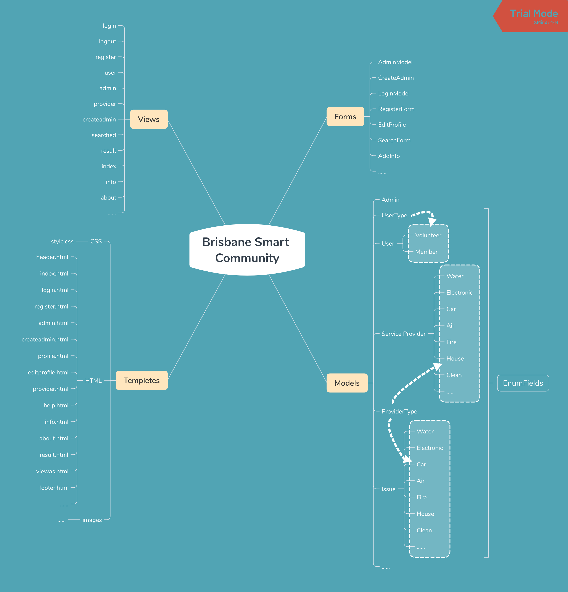

# 专业方向课程设计
#### 金陵科技学院 国际教育学院 G16软件工程
##### 何志鹏 1622441019
----------------

>### 任务要求
- 任务：使用Django + MySQL + Python 实现上学期的User Story
- 要求：每个同学单独完成
- 具体要求
   - 工程名称：project_学号
   - 类名：xxx_学号
   - 函数名：xxx_学号
   - 模块名：xxx_学号
   - 网页名：xxx_学号.html
   - 数据库名：xxx_学号
- 第4周中期检查，第7周演示答辩

----------------

>### 任务目标
- 课程设计报告纸质版（双面打印）
- 电子版（命名要求：学号姓名.doc）
- 项目工程及数据库打包压缩（命名要求：学号姓名.zip）

----------------

>### 任务背景
布里斯班的一个当地移民社区团体有很多成员，他们工作时间很短，缺乏适当的英语技能。由于这些问题，他们经常难以找到并与服务提供商谈判，例如水管工，电工，汽车维修，空调，建筑工作等，以解决他们家中的服务问题。为了帮助他们的成员，社区团体通过代表成员联系服务提供商，协商更好的价格，并在会员报告的首选日期（日期）和时间分配工作，帮助解决会员的服务问题。

社区团体几乎没有专门的志愿者，他们通过在社区建设办公室操作白天/晚上的不同时间来帮助他们的成员。会员通过电话致电办公室并报告他/她的服务问题。他们经常出现在办公室报告他们的请求。

志愿者从会员那里收集细节，并在一份文件中写下来，并将这份工作分配给一位志愿者，他在白天可以使用。他/她在电子表格中为此请求创建了一个条目，其状态为“打开”以及他/她在论文中记录的所有详细信息。

创建请求分配的志愿者必须将该请求分配给志愿者，该志愿者帮助居住在布里斯班南部，布里斯班以北，布里斯班以东或布里斯班以西等特定区域的成员。此外，志愿者不应该分配给他/她的许多工作，以避免缓慢的响应时间。

志愿者通过电话联系最少三家服务提供商并协商最优惠的价格。他/她写下每次谈判的细节，由他/她或在会员首选联系日/时间工作的其他志愿者向会员报告。始终将作业分配给已引用服务最低价格的服务提供商。如果会员接受优惠，志愿者会再次联系服务提供商，并将联系电话和优惠日期/时间通知会员的地址详细信息。他/她还将请求状态更改为“关闭”。

当社区成员的数量较少时，基于纸张和电子表格的这个系统工作正常。但是，现在系统已经崩溃，发现了几个问题。

成员们报告说，他们永远不知道他们提出的请求的状态。没有志愿者的沟通，他们可以过几天，有时甚至几周。在成员看来，没有任何沟通意味着没有人按照他们的要求工作。他们觉得通常志愿者不知道如何联系他们提出进一步的问题或沟通进展。他们经常提供有关服务提供商服务质量差的反馈，但他们认为这不是财产记录。会员还认为，与志愿者联系的时间较少，不方便，而且当他们联系电话线路繁忙或没有人回应时。

志愿者觉得他们超载了。请求信息保存在Excel电子表格中。最初有一两名志愿者在工作，但现在有几名志愿者独立工作。每个志愿者都需要查看或更新电子表格，其中包含有关分配请求的信息。越来越多的志愿者访问同一个电子表格会导致问题，因为在任何给定时间只有一个人可以打开和关闭电子表格。志愿者也厌倦了希望更新其请求状态的成员不断呼叫。在某些日子/时间通常很少有志愿者，因为一些志愿者在服务期间由于他们的个人问题而不会出现。还没有足够的机制来记录成员关于服务提供商服务的反馈。

显然，目前的制度不再适用，因为成员和志愿者都不满意。如上所述，您的工作是提出满足成员和志愿者需求的系统。

----------------

>### 用户故事

----------------

>### 架构设计

----------------

>### 功能设计

---------------

>### 界面设计

----------------
